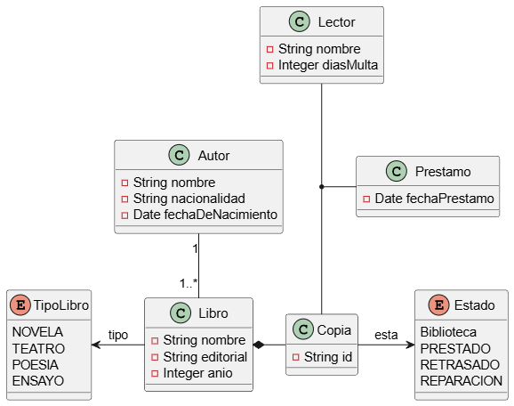

# Proyecto de ejemplo maven

## Gestion de biblioteca

- Una **biblioteca** _tiene_ **copias** de **libros**. Estos ultimos se caracterizan por su **nombre**, **tipo** (novela, teatro, poesia, ensayo), **editorial**, **anio** y **autor**.
- Los autores se caracterizan por su nombre **nacionalidad** y **fecha de nacimiento**.
- Cada copia _tiene_ un **identificador**, y puede _estar_ en la **biblioteca**, **prestada**, **con retraso** o en **reparacion**.
- Los **lectores** pueden _tener_ un maximo de 3 libros en prestamo.
- Cada libro se _presta_ por un maximo de 30 dias, por cada dia de retraso se _impone_ una **multa** de dos dias sin posibilidad de _pedir_ un nuevo libro

Realiza un diagrama de clases y aniade los metodos necesarios para realizar el prestamo y devolucion de libros

## Modelo de datos

